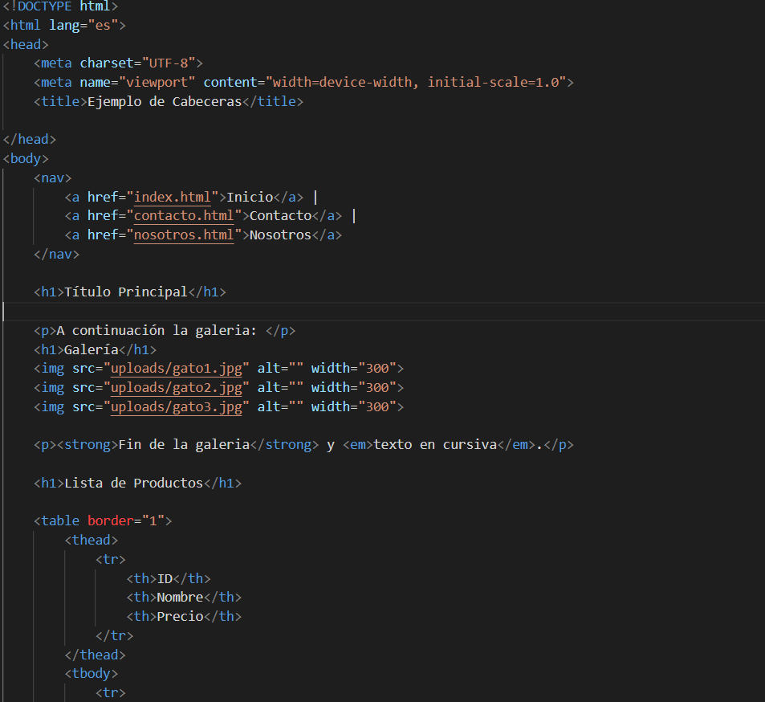
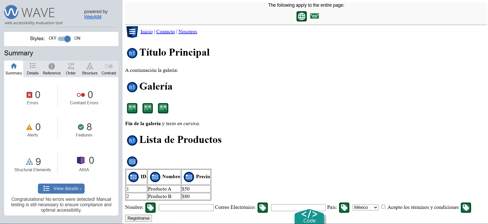
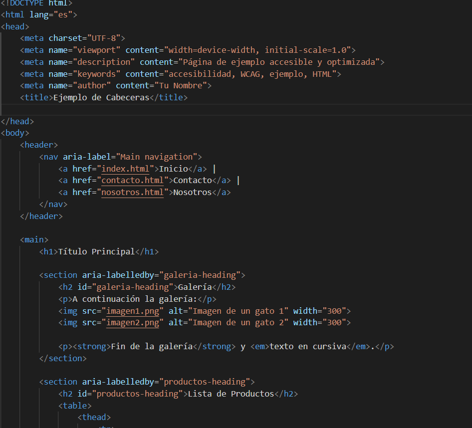
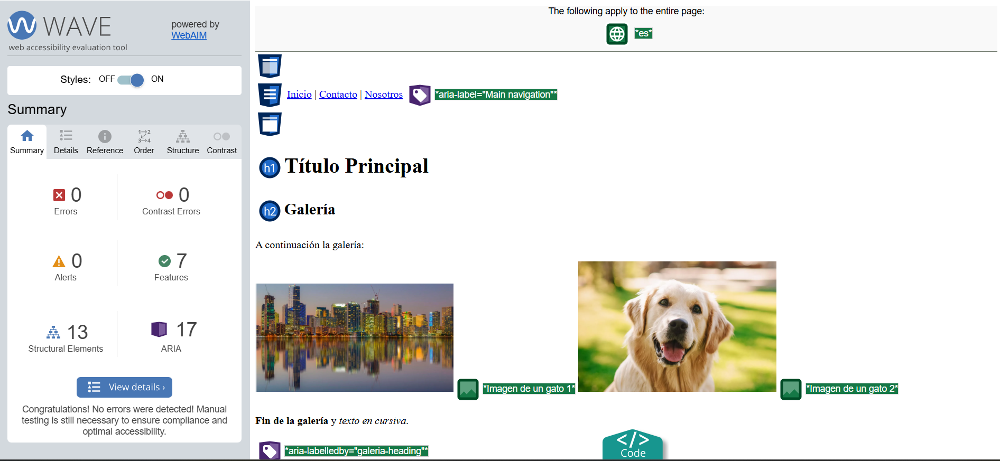

# Proyecto de Accesibilidad Web según WCAG 2.2

Este proyecto tiene como objetivo demostrar cómo se puede mejorar la accesibilidad de una página web utilizando las pautas de accesibilidad WCAG 2.2. El código HTML de ejemplo se ha modificado para cumplir con los criterios A, AA y AAA de accesibilidad, aplicando las mejores prácticas de accesibilidad web, incluyendo el uso de atributos ARIA, etiquetas semánticas de HTML5, textos alternativos para imágenes y mejoras en la navegación por teclado.

## Objetivos

- Modificar un archivo HTML para que sea accesible según la normativa WCAG 2.2.
- Asegurarse de que el código cumpla con los criterios A, AA y AAA de accesibilidad.
- Utilizar herramientas de validación de accesibilidad como **WAVE**, **Axe**, y **Lighthouse**.
- Documentar el proceso de mejora de la accesibilidad y los cambios realizados en el código.

## Prompt
Modifica el siguiente código HTML para cumplir con las pautas de accesibilidad WCAG 2.2 (niveles A, AA y AAA). Asegúrate de:

Añadir atributos ARIA en los elementos interactivos como formularios, botones, imágenes y enlaces.
Mejorar la semántica usando etiquetas HTML5 adecuadas (<header>, <main>, <section>, <nav>, <footer>).
Incluir descripciones accesibles en imágenes mediante alt adecuados y, si es necesario, aria-describedby.
Asegurar una correcta jerarquía de encabezados (<h1>, <h2>, <h3>, etc.).
Garantizar un adecuado contraste de colores y accesibilidad para la navegación con teclado.
Incluir roles ARIA y etiquetas aria-live en mensajes dinámicos si los hay.
Optimizar la accesibilidad de formularios, asegurando etiquetas <label> correctamente asociadas y utilizando aria-invalid, aria-required, y aria-describedby para errores de validación.

### 1. **Accesibilidad de la Navegación:**
   - **Cambio:** Se añadieron los atributos `role="link"` y `aria-label` a los enlaces de navegación.
   - **Objetivo:** Mejorar la comprensión de los enlaces de navegación para usuarios con tecnologías de asistencia.
   - **Ejemplo:** 
     ```html
     <a href="index.html" role="link" aria-label="Ir a inicio">Inicio</a>
     ```

### 2. **Etiquetas Semánticas HTML5:**
   - **Cambio:** Se mejoró la estructura semántica del documento usando etiquetas HTML5 adecuadas como `<header>`, `<main>`, `<section>`, y `<footer>`.
   - **Objetivo:** Mejorar la organización y accesibilidad del contenido, facilitando la navegación para usuarios de tecnologías asistivas.
   - **Ejemplo:**
     ```html
     <header>
         <h1>Título Principal</h1>
     </header>
     ```

### 3. **Imágenes:**
   - **Cambio:** Se añadieron descripciones significativas en el atributo `alt` de las imágenes.
   - **Objetivo:** Asegurarse de que las imágenes sean accesibles para usuarios con discapacidades visuales.
   

### 4. **Formulario:**
   - **Cambio:** Se añadió el atributo `aria-required="true"` a los campos obligatorios del formulario y se utilizó `aria-label` para describir los campos.
   - **Objetivo:** Mejorar la accesibilidad de los formularios, asegurando que los usuarios con tecnologías asistivas comprendan los campos requeridos.
   - **Ejemplo:**
     ```html
     <input type="text" id="nombre" name="nombre" aria-required="true" placeholder="Introduce tu nombre" aria-label="Campo para introducir el nombre">
     ```

### 5. **Botones y Acciones:**
   - **Cambio:** Se añadieron atributos `aria-label` a los botones para describir de manera más precisa su funcionalidad.
   - **Objetivo:** Mejorar la comprensión de las acciones de los botones.
   - **Ejemplo:**
     ```html
     <button onclick="alert('Hola!')" aria-label="Mostrar mensaje de alerta">Haz Clic</button>
     ```

### 6. **Mejoras en la Navegación por Teclado:**
   - **Cambio:** Se aseguró que los elementos interactivos, como los botones y formularios, fueran accesibles mediante teclado.
   - **Objetivo:** Garantizar que los usuarios que navegan solo con el teclado puedan interactuar con todos los elementos de la página.

### 7. **Contraste de Color:**
   - **Cambio:** Se verificó que el contraste entre el texto y el fondo fuera adecuado para usuarios con discapacidades visuales.
   - **Objetivo:** Asegurar que el texto sea legible para todos los usuarios.

## Herramientas de Validación Usadas

- **WAVE:** [WAVE Web Accessibility Evaluation Tool](https://wave.webaim.org/)
- **Axe:** [Axe Accessibility Testing](https://www.deque.com/axe/browser-extensions/)
- **Lighthouse:** Herramienta integrada en Google Chrome DevTools.
- **Accesibilidad Insight:** Herramienta de validación de accesibilidad.
- **Lighthouse:** Herramienta de Google para auditorías de accesibilidad.
  
## Proceso de Validación

### Pasos Realizados:

1. **Prueba Inicial:** Se validó el código original utilizando **WAVE** y **Axe**. Los resultados mostraron varios errores y advertencias en cuanto a accesibilidad.
2. **Modificación del Código:** Se aplicaron los cambios mencionados para mejorar la accesibilidad, como la adición de atributos ARIA, el uso de etiquetas semánticas y la mejora de la accesibilidad de formularios y botones.
3. **Validación de la Versión Modificada:** Después de realizar las modificaciones, se volvió a ejecutar el código a través de **WAVE** y **Axe** para asegurar que cumpliera con los criterios de accesibilidad.
4. **Iteración:** En algunos casos, se ajustaron detalles adicionales, como el contraste de color y los textos alternativos de las imágenes.

### Resultados de Validación

- **Antes de la Modificación:** El código original contenía varias advertencias, especialmente relacionadas con los atributos `alt` en las imágenes, el contraste de color y la falta de atributos ARIA en los formularios.
- **Después de la Modificación:** Los resultados de las herramientas de validación mostraron que la mayoría de las advertencias se resolvieron y el código cumplía con los criterios **AA** de WCAG 2.2. También se logró mejorar la navegación por teclado y la comprensión de los enlaces y formularios.

## Capturas de Pantalla

Codigo antes de ser modificado y codigo evaluado por wave sin modificar:
 y 

Codigo modificado y codigo evaluado por wave modificado:
 y 

## Conclusión

Este proyecto ha permitido aplicar las mejores prácticas de accesibilidad web para mejorar la usabilidad y accesibilidad de una página HTML según las pautas WCAG 2.2. Después de iterar el código con varias herramientas de validación, se logró cumplir con los criterios **AA** de accesibilidad.

## Archivos Incluidos en el Repositorio

- `index.html`: Código original sin modificaciones.
- `index_modificado.html`: Código modificado según los estándares de accesibilidad WCAG 2.2.
- `README.md`: Documentación del proyecto y el proceso de validación.
- Capturas de pantalla de las herramientas de validación de accesibilidad.

